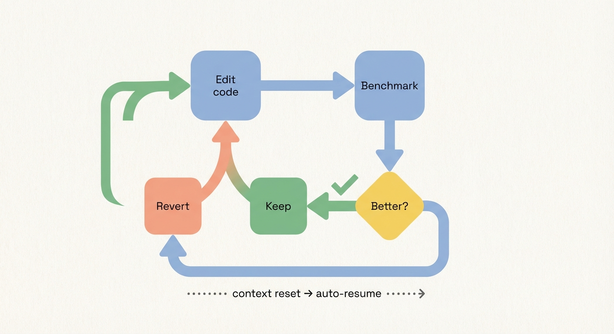

# claudecode-autoresearch

Autonomous experiment loop for Claude Code. Edit, benchmark, keep or discard, repeat forever.

*Inspired by [pi-autoresearch](https://github.com/davebcn87/pi-autoresearch) and [karpathy/autoresearch](https://github.com/karpathy/autoresearch).*

---

## What it does

Claude runs an optimization loop autonomously: edit code, run benchmark, keep if better, revert if worse, repeat. It never stops unless you tell it to. Survives context resets via auto-resume.

Works for any optimization target: test speed, bundle size, build times, training loss, Lighthouse scores.

## Install

Via the marketplace:
```bash
claude plugins install claudecode-autoresearch@sderosiaux-claude-plugins
```

Manual:
```bash
git clone https://github.com/sderosiaux/claudecode-autoresearch ~/.claude/plugins/manual/claudecode-autoresearch
```

## Usage

### Start a session

```
/autoresearch:create optimize unit test runtime
```

Claude asks about your goal, command, metric, and files in scope (or infers from context). Then it creates a branch, writes config files, runs the baseline, and starts looping.

### The loop



### Example session

You ask Claude to optimize your test suite runtime:

```
/autoresearch:create optimize vitest execution time
```

Claude creates the branch, benchmark script, and starts looping. Here's what a real session looks like:

```
#   Status          Metric    Description
1   keep            42.3s     baseline
2   keep            38.1s     parallelize test files across 4 workers
3   discard         39.0s     switch to happy-dom (slower than jsdom here)
4   keep            31.7s     lazy-import heavy test fixtures
5   crash           0s        syntax error in config — auto-fixed, moving on
6   keep            28.4s     replace glob imports with explicit paths
7   checks_failed   25.1s     aggressive mocking broke 3 integration tests
8   keep            26.9s     selective mocking — tests pass, still faster
...
```

```
Session: optimize vitest execution time
Runs: 8 | 5 kept | 1 discarded | 1 crashed | 1 checks_failed
Baseline: 42.3s
Best:     26.9s (-36.4%)
```

Claude never stops. It keeps trying ideas, reverting bad ones, committing good ones. When it hits a context limit, the Stop hook auto-resumes a fresh session that picks up where it left off.

### Commands

| Command | Purpose |
|---------|---------|
| `/autoresearch:create` | Setup: goal, command, metric, branch, config files |
| `/autoresearch` | Resume/continue the loop |
| `/autoresearch:stop` | Remove state file, end auto-resume |
| `/autoresearch:status` | Print dashboard |

## How it works

The plugin has three layers:

**Scripts** run benchmarks and record results. `run-experiment.sh` times your command and runs optional correctness checks. `log-experiment.sh` writes to the JSONL log and handles git (commit on keep, revert on discard).

**Skills** teach Claude the loop. `/autoresearch:create` sets up the session. `/autoresearch` resumes it. Claude reads `autoresearch.md` for context and runs the scripts via Bash.

**Hooks** keep the loop alive. When Claude hits a context limit, the Stop hook blocks the exit and re-injects the loop prompt. The UserPromptSubmit hook reminds Claude it's in autoresearch mode.

### Files in your project

| File | Purpose |
|------|---------|
| `autoresearch.jsonl` | Append-only experiment log (one JSON line per run) |
| `autoresearch.md` | Session doc: objective, files in scope, what's been tried |
| `autoresearch.sh` | Your benchmark script |
| `autoresearch.checks.sh` | Optional correctness checks (tests, types, lint) |

A fresh Claude session can resume from `autoresearch.md` + `autoresearch.jsonl` alone.

### Auto-resume

When Claude stops (context limit, crash), the Stop hook checks for an active state file. If found: block the exit, inject a resume prompt, Claude continues. Up to 50 iterations (configurable), with a 30s cooldown between resumes and crash detection after 3 consecutive failures. `/autoresearch:stop` disables it.

## Example domains

| Domain | Metric | Command |
|--------|--------|---------|
| Test speed | seconds (lower) | `pnpm test` |
| Bundle size | KB (lower) | `pnpm build && du -sb dist` |
| Build speed | seconds (lower) | `pnpm build` |
| Training loss | val_bpb (lower) | `uv run train.py` |
| Lighthouse | perf score (higher) | `lighthouse http://localhost:3000 --output=json` |

## Try it

Clone and run the demo — no Claude Code needed, just `bash`, `git`, `node`, and `jq`:

```bash
git clone https://github.com/sderosiaux/claudecode-autoresearch
cd claudecode-autoresearch
bash tests/demo.sh
```

This simulates 5 iterations (2 keeps, 1 discard, 1 crash, 1 checks_failed) on a toy JS file and prints the dashboard.

Run the full test suite (29 tests covering all scripts and hooks):

```bash
bash tests/test-scripts.sh
```

## License

MIT
