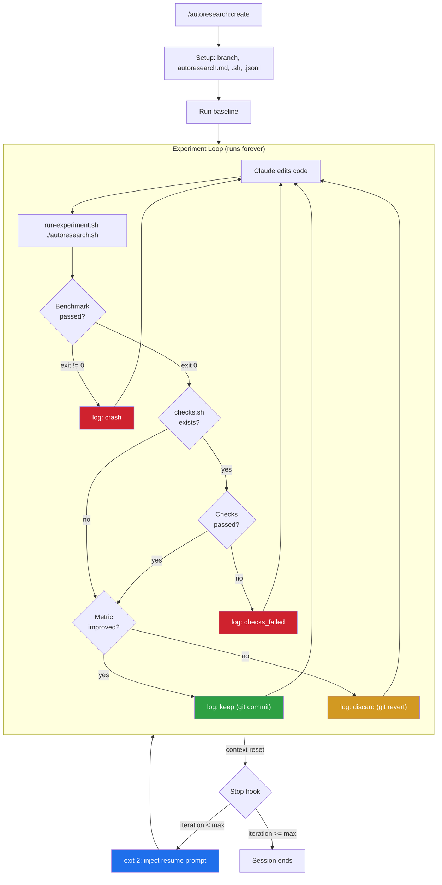
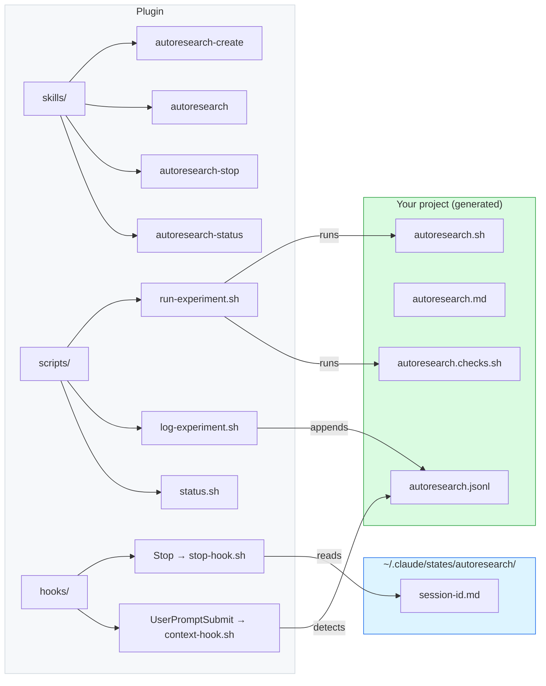
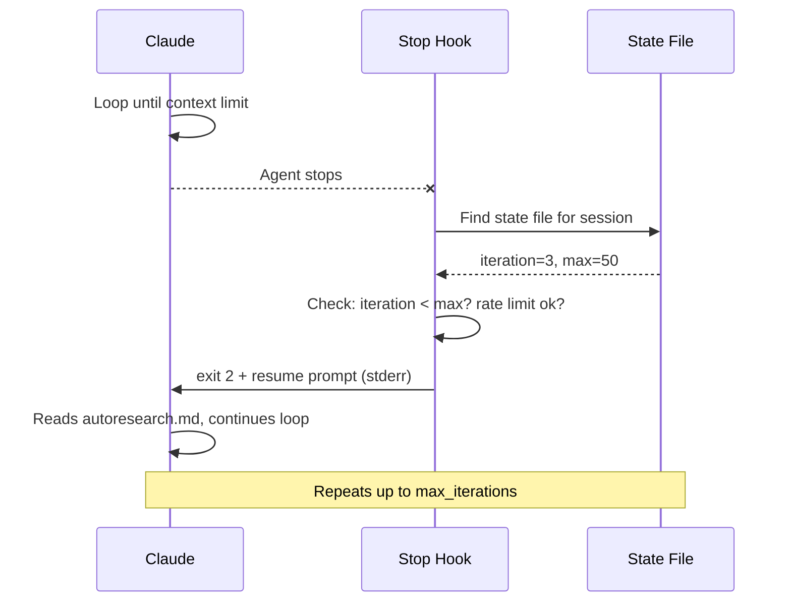

# claudecode-autoresearch

Autonomous experiment loop for Claude Code. Edit, benchmark, keep or discard, repeat forever.

*Inspired by [pi-autoresearch](https://github.com/davebcn87/pi-autoresearch) and [karpathy/autoresearch](https://github.com/karpathy/autoresearch).*

---

## What it does

Claude runs an optimization loop autonomously: edit code, run benchmark, keep if better, revert if worse, repeat. It never stops unless you tell it to. Survives context resets via auto-resume.

Works for any optimization target: test speed, bundle size, build times, training loss, Lighthouse scores.

## Install

Via the marketplace:
```bash
claude plugins install claudecode-autoresearch@sderosiaux-claude-plugins
```

Manual:
```bash
git clone https://github.com/sderosiaux/claudecode-autoresearch ~/.claude/plugins/manual/claudecode-autoresearch
```

## Usage

### Start a session

```
/autoresearch:create optimize unit test runtime
```

Claude asks about your goal, command, metric, and files in scope (or infers from context). Then it creates a branch, writes config files, runs the baseline, and starts looping.

### The loop



### Commands

| Command | Purpose |
|---------|---------|
| `/autoresearch:create` | Setup: goal, command, metric, branch, config files |
| `/autoresearch` | Resume/continue the loop |
| `/autoresearch:stop` | Remove state file, end auto-resume |
| `/autoresearch:status` | Print dashboard |

## How it works



### Persistence

| File | Purpose |
|------|---------|
| `autoresearch.jsonl` | Append-only experiment log |
| `autoresearch.md` | Session doc (objective, files, what's been tried) |
| `autoresearch.sh` | Benchmark script |
| `autoresearch.checks.sh` | Optional correctness checks (tests, types, lint) |

A fresh Claude session can resume from `autoresearch.md` + `autoresearch.jsonl` alone.

### Auto-resume



Safety limits:
- Max 50 iterations (configurable)
- Min 30s between resumes
- Crash detection: warns after 3 consecutive failures
- `/autoresearch:stop` disables it

## Example domains

| Domain | Metric | Command |
|--------|--------|---------|
| Test speed | seconds (lower) | `pnpm test` |
| Bundle size | KB (lower) | `pnpm build && du -sb dist` |
| Build speed | seconds (lower) | `pnpm build` |
| Training loss | val_bpb (lower) | `uv run train.py` |
| Lighthouse | perf score (higher) | `lighthouse http://localhost:3000 --output=json` |

## Testing

```bash
bash tests/test-scripts.sh
```

## License

MIT
